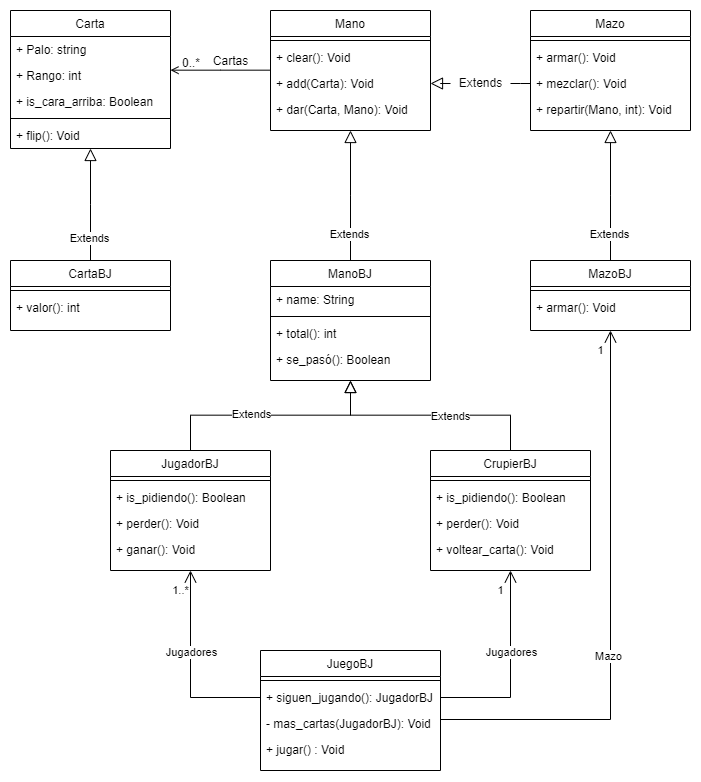

<h1> Black Jack </h1>

Juego de cartas "Black Jack" implementado en Python con el fin de aprender POO.<br>

## Jugar
_Para ejecutarlo correr en consola:_<br>
```
python JuegoBJ.py
```

## Implementación: clases base

Primero empecé creando las tres clases base: [Carta](Carta.py), [Mano](Mano.py) y [Mazo](Mazo.py). 

###### Carta

Cada carta cuenta con un valor (As, número, J, Q o K), un palo (Corazón, Diamante, Trébol o Pica) y un atributo que permite determinar si la carta esta cara arriba o cara abajo.
Como comportamiento tiene la implementación del metodo str y un metodo __flip__ que permite "dar vuelta" una carta.

###### Mano

Una mano es un conjunto de cartas, es por esto que la clase __Mano__ cuenta con el atributo cartas, que es un arreglo de objetos de tipo Carta.
Como comportamiento tiene la implementacion del metodo str, el metodo __clear__ que permite vaciar la Mano, el metodo __add__ que permite agregar cartas a la Mano y el metodo __dar__ que permite pasar una carta a otra Mano.

###### Mazo

Un Mazo no es más que una Mano que contiene todas las cartas en un principio, es por esto que hereda de la clase __Mano__. La clase __Mazo__ no tiene atributos propios, solo aquellos heredados de la clase __Mano__.
Como comportamiento tiene la implementación del metodo __armar__ que permite cargar todas las cartas en el mazo, el metodo __mezclar__ y el metodo __repartir__ que permite dar cartas a otras manos.

## Implementación: clases para black-jack

Luego de tener las clases base, implementé las clases necesarias para poder jugar: [CartaBJ](CartaBJ.py), [ManoBJ](ManoBJ), [MazoBJ](MazoBJ), [JugadorBJ](JugadorBJ), [CuprierBJ](CuprierBJ) y [JuegoBJ](JuegoBJ)


## Diagrama de clases



## Links externos

* [BlackJack](https://es.wikipedia.org/wiki/Blackjack)